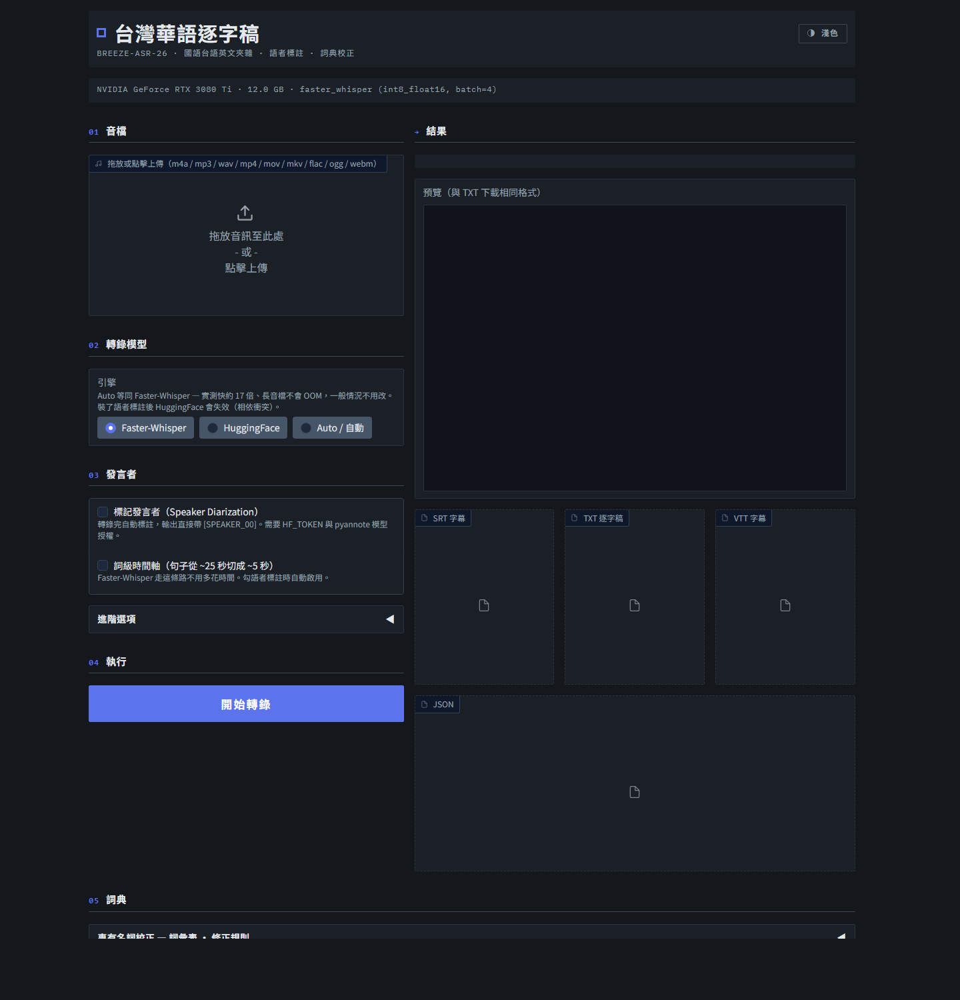

# taigi-asr

**台灣中文＋台語逐字稿工具** — 國語、台語、中英夾雜的錄音，
都能轉成帶時間軸與發言者標記的逐字稿。

以 [MediaTek **Breeze-ASR-26**](https://huggingface.co/MediaTek-Research/Breeze-ASR-26) 為核心，
加上 [pyannote.audio](https://github.com/pyannote/pyannote-audio) 語者分離與可自訂的專有名詞詞典。
輸出 SRT / TXT / VTT / JSON。

**完全在本地運行** — 錄音不會離開你的電腦，沒有任何 API 計費或 token 費用。
模型下載後即可離線轉錄。



> 本專案改作自 [thc1006/breeze-asr-taigi](https://github.com/thc1006/breeze-asr-taigi)（MIT License，
> 原作者 蔡秀吉）。詳見文末「授權與來源」。

---

## 這個工具能做什麼

拖一段錄音進去，按一個鍵，得到：

```
[00:00:00] SPEAKER_00：大家好 今天想先跟各位報告上半年的進度 前面三項都已經完成了 第四項還在收尾

[00:00:17] SPEAKER_01：請問第四項大概什麼時候會好

[00:00:20] SPEAKER_00：預計這個月底 詳細的時程表放在附件裡面
```

- **國語、台語、英文夾雜都行**：模型以約 10,000 小時台語語料微調（含台語↔華語
  code-switching），底層是多語言的 Whisper-large-v2。實測一場以台灣中文為主、
  夾台語和英文術語（KPI、OEE…）的 2.5 小時會議，轉出約 4 萬字、品質良好——
  台灣日常的講話方式就是它的主場
- **發言者自動分離**，同一人連續發言會合併成一段，時間只標在換人處
- **專有名詞詞典**：教它人名、機構、術語怎麼寫，或把固定聽錯的詞替換掉
- **全程本地推論、零使用費**：不呼叫任何雲端 API，錄音與逐字稿都留在自己機器上——
  機密會議、個資訪談也能安心用
- 2.5 小時的錄音約 **6 分鐘**跑完（RTX 3080 Ti）

### 適用場合

任何「需要逐字稿」的錄音都可以，不限會議：

| 場合 | 用得上的功能 |
|---|---|
| **會議紀錄** — 部門會議、專案討論 | 語者標註分清誰講的；詞彙表校正內部術語 |
| **講座 / 演講** — 內部分享、研討會 | 主講與 Q&A 提問者自動分開 |
| **課程錄影** — 教學影片、線上課程 | SRT / VTT 直接當字幕上片 |
| **訪談** — 人物專訪、使用者研究、記者採訪 | 兩人對談的語者分離最準 |
| **田野調查 / 口述歷史** — 長輩訪談、地方誌、語言保存 | 台語辨識是模型的微調重點，長輩的台語國語切換也處理得來 |
| **Podcast / 廣播節目** | 產出逐字稿做 SEO、摘要或翻譯底稿 |
| **講道 / 社區宣導** | 台語為主的長篇獨白 |

只有一位講者時，可以不勾「標記發言者」，速度更快也不需要 HuggingFace token。
要做字幕就勾「詞級時間軸」，句子會從 ~25 秒切成 ~5 秒，長度剛好適合上字幕。

---

## 硬體需求

| | 最低 | 建議 |
|---|---|---|
| GPU | 無 GPU 也能跑（CPU，慢很多） | NVIDIA 4 GB VRAM 以上 |
| 磁碟 | 約 8 GB（含模型與 CUDA 套件） | |
| Python | 3.10 | 3.11 |

> Python 3.10–3.12 都在 CI 測試範圍內（Linux 三版 + Windows 3.11）。
> 語者標註需要 `torch>=2.8`，實測環境為 Python 3.11 + CUDA 12.8。

實測參考：RTX 3080 Ti (12 GB) 轉錄 2.5 小時錄音約 4 分鐘，語者標註再約 2 分鐘。
RTX 3050 Laptop 4 GB 也能跑（int8 量化下峰值 VRAM 約 2.9 GB），只是慢一些。

---

## 安裝（從零開始）

### 1. 前置：Python 3.11 與 ffmpeg

```powershell
winget install Python.Python.3.11
winget install Gyan.FFmpeg
```

裝完**開一個新的終端機**（PATH 才會更新），確認：

```powershell
python --version    # 3.10 ~ 3.12
ffmpeg -version     # 任何版本都可以
```

### 2. 取得專案並安裝

```powershell
git clone https://github.com/robinlin-yichia/breeze-asr-taigi.git
cd breeze-asr-taigi
.\install.bat
```

`install.bat` 會建立 `.venv`、安裝 CUDA 版 PyTorch 與相依套件、預先下載模型（約 3 GB，
第一次會跑比較久）。

Linux / WSL2 用 `./install.sh`。

### 3. 啟動

```powershell
.\start.bat
```

瀏覽器會自動開 <http://127.0.0.1:7860>。到這裡**轉錄功能就可以用了**。

---

## 啟用語者標註（選用，但建議）

沒有這一步也能轉錄，只是不會標發言者。要用的話有三件事要做：

### 1. 安裝 pyannote

```powershell
.\.venv\Scripts\activate
pip install -e ".[diar]"
```

### 2. 在 HuggingFace 同意三個模型的授權

用你的 HuggingFace 帳號逐一點進去按同意：

1. <https://huggingface.co/pyannote/speaker-diarization-3.1>
2. <https://huggingface.co/pyannote/segmentation-3.0>
3. <https://huggingface.co/pyannote/speaker-diarization-community-1>

> **第三個最容易漏掉。** pyannote 4.x 就算你指定 3.1，內部預設的 checkpoint 仍會指向
> community-1，少了它會在載入時噴 403。

### 3. 設定 token

> **這個 token 是免費的，只作身分驗證用。** pyannote 的模型是 gated（下載前要
> 在網頁上同意條款、留個聯絡方式），token 只是讓下載程式證明「你就是那個同意過
> 條款的帳號」。**沒有任何計費**——模型下載下來之後，語者標註和轉錄一樣全在
> 本地 GPU 上跑，不會呼叫 HuggingFace 的付費服務，離線也能用。

到 <https://huggingface.co/settings/tokens> 產生一個 read 權限的 token，然後設成環境變數：

```powershell
setx HF_TOKEN hf_xxxxxxxxxxxxxxxx
```

`setx` 是永久設定，**設完要重開終端機**。驗證：

```powershell
.\.venv\Scripts\python.exe -c "import os; print('OK' if os.environ.get('HF_TOKEN') else 'NOT SET')"
```

### 4. 驗證整條路徑通了

這行會實際載入 pipeline 並放到 GPU，成功才代表三個授權都過了：

```powershell
.\.venv\Scripts\python.exe -c "import torch; from taigi_asr import diarize as d; d.get_pipeline(d.token_from_env(), 'cuda'); print('OK, VRAM %.2f GB' % (torch.cuda.memory_allocated()/1024**3))"
```

印出 `OK` 就完成了。回到 UI 勾「標記發言者」即可。

> **注意：裝了 pyannote 之後，HuggingFace 引擎會失效。** 原因見下方「模型取捨」。
> 這是刻意的取捨——Faster-Whisper 本來就是比較好的選擇。

---

## 使用流程

| 步驟 | 說明 |
|---|---|
| ① 音檔 | 拖放。支援 m4a / mp3 / wav / mp4 / mov / mkv / flac / ogg / webm |
| ② 轉錄模型 | 預設 Faster-Whisper，不用改 |
| ③ 發言者 | 勾「標記發言者」會自動一起啟用詞級時間軸；已知人數可填「已知語者人數」，留 0 就自動判斷。「語者改名」填 `SPEAKER_00=王經理`（一行一組），轉錄完再填、按「重新套用」即可換成真名，不必重跑 |
| ④ 開始轉錄 | 進度會顯示在按鈕下方 |
| ⑤ 詞典 | 需要時展開，改完可以直接重套，不必重跑轉錄 |

「進階選項」裡可以選輸出格式（SRT / TXT / VTT / JSON）與 beam size。
右上角可切換深色／淺色，選擇會記在瀏覽器裡。

**語者標註失敗不會中斷轉錄** —— 逐字稿照樣產出，狀態列會說明原因（缺 token、
授權未過等）。跑了十分鐘的結果不會因為這個被丟掉。

### 三種輸出格式的語者標記方式不同

各自用途不一樣，所以刻意不一視同仁：

| 格式 | 做法 | 理由 |
|---|---|---|
| **TXT** | 同一人連續發言合併成一段，時間只標在換人處 | 給人讀的逐字稿（會議紀錄、訪談稿） |
| **SRT / VTT** | 逐句 cue 不變，語者標籤只出現在換人的那一句 | 字幕時間軸必須逐句對齊，不能合併成好幾分鐘一個 cue |
| **JSON** | 每一句都帶語者 | 給程式讀的，欄位齊全比簡潔重要 |

UI 的預覽框顯示的就是 TXT 的樣子——看到什麼，下載的就是什麼。

### 專有名詞：兩種機制，用途不同

**詞彙表** — 只填正確寫法，一行一個。人名、廠商、內部術語放這裡。
這些詞會在轉錄時餵給解碼器（faster-whisper 的 `hotwords`），讓它一開始就別聽錯。
你不需要知道它會錯成什麼。

**修正規則** — 知道它固定錯成某個寫法時，用這個做事後替換。
可以在 UI 用兩個欄位快速新增一筆（填完按 Enter 就存檔），或直接在下方表格裡
批次增刪改。勾「正則」時「錯誤寫法」會當成正規表示式
（例如 `\b縮寫\b` 只比對完整字詞、`甲 ?乙` 容許中間有空格）。

改完詞典按「重新套用詞典到上次的轉錄結果」，會從原始辨識文字重跑一次校正——
**不會重新轉錄，也不會重跑語者標註**。刪掉規則也會還原。語者標籤原樣保留。
2.5 小時的錄音重跑轉錄要幾分鐘，這顆按鈕是秒回。

實測（120 秒片段，先挑出 8 個已知會被聽錯的專有名詞）：把正確寫法加進詞彙表後，
**6 個在解碼階段就直接寫對了，沒有任何原本正確的字被改壞**。唯一沒修好的那個，
是因為詞彙表填的詞和實際講的詞不完全一樣——所以要填**你真正會講的完整詞**。

> 詞彙表是**全域偏向**，不是精準替換：同一段裡不相干的字也可能微幅變動。
> 只加你真正常講的詞，不要為了「以防萬一」塞一堆用不到的。

### 詞典檔放哪裡

版控的 `terms.example.json` 是**空的**——只有格式說明，沒有任何預設詞。
詞典本來就跟領域綁定，預先塞某個行業的術語只會干擾其他人的辨識。

**第一次執行時會自動複製成 `terms.json`**，那份才是你的個人詞典，不進版控——
所以每個人各自累積，不會互相衝突，也不會不小心把人名或客戶名推上去。

一開始是空的，在 UI 裡慢慢加就好：聽到哪個詞老是錯，就把正確寫法丟進詞彙表。

尋找順序：

1. 環境變數 `TAIGI_ASR_TERMS` 指定的路徑
2. 目前工作目錄的 `terms.json`
3. 專案根目錄的 `terms.json`
4. 都沒有 → 從 `terms.example.json` 複製一份

存檔前會自動備份成 `terms.json.bak`，寫入用暫存檔 + 原子替換，中途斷電不會留半個檔。
壞掉的正則會被擋下不寫入，整份規則全空時拒絕存檔（避免把詞典清空）。

---

## 模型取捨（為什麼預設是 Faster-Whisper）

兩個引擎跑的是**同一個模型**：Faster-Whisper 用的是 Breeze-ASR-26 的
[CTranslate2 轉換版](https://huggingface.co/paulpengtw/faster-whisper-Breeze-ASR-26)，
HuggingFace 用的是 [MediaTek 官方權重](https://huggingface.co/MediaTek-Research/Breeze-ASR-26)。

實測（RTX 3080 Ti 12 GB，120 秒多人對話音檔，字數為去空白後的字元數）：

| 引擎 / 設定 | 字數 | 段數 | 耗時 |
|---|---|---|---|
| Faster-Whisper `int8_float16` | 529 | 21 | **3.3 s** |
| Faster-Whisper `float16` | 531 | 21 | 3.3 s |
| HuggingFace `float16` | 520 | 60 | 57.0 s |

**速度差 17 倍**，來自兩個相乘的原因：

1. **執行引擎**（約 2.6 倍）— CTranslate2 是專為 transformer 推論寫的 C++ 引擎；
   HuggingFace 走 PyTorch。而 `huggingface.py` 想用 `torch.compile` 補這個差距，
   但它在 Windows 上**一直是失效的**（inductor 後端需要 triton，Windows 沒有），
   例外被接住後靜默退回 eager 模式。
2. **詞級對齊**（再乘 6.7 倍）— transformers 用 PyTorch 做 cross-attention DTW，
   而且要保留整段音檔各層的注意力矩陣，**記憶體隨長度成長**。實測 2.5 小時的錄音
   跑了 138 分鐘後 CUDA OOM（VRAM 吃到 11998/12288 MiB）。
   CTranslate2 逐段對齊，記憶體有界，同一個檔案 230 秒跑完。

**關於 `int8_float16` 量化**：預設不是「犧牲品質換速度」。它把模型權重壓成 8-bit
（VRAM 從約 3.1 GB 降到 1.6 GB），運算仍用 float16 累加。實測與 float16 的輸出
相似度 99.81%（整段逐字稿只差一個「那個」）、速度相同——選它純粹是省一半 VRAM：
4 GB 顯卡塞得下，大卡則把空間留給語者標註的模型。VRAM ≥ 14 GB 時 router 會自動
改用 float16 並拉大 batch，那是為了吞吐量，不是品質。

**品質**：兩者字元相似度 95.5%。18 處差異裡多數是 HuggingFace 漏詞；
少數可用上下文判定的替換（追蹤 vs 跟蹤、自修費 vs 自收費）Faster-Whisper 都對。
單一樣本、無人工校對的標準答案，所以這**不是** WER 數據，只能說沒有證據顯示 HF 比較準。

### 那什麼時候該用 HuggingFace？

引擎仍然保留在 UI 選單裡，因為有幾個它才行的情況：

- **Apple Silicon**：CTranslate2 只支援 CUDA 與 CPU，沒有 Metal 後端。
  Mac 上 Faster-Whisper 只能跑 CPU，而 HuggingFace 可以走 MPS。
- **官方權重**：Faster-Whisper 依賴社群轉換版。若該轉換版失效或落後於官方更新，
  HuggingFace 直接讀 MediaTek 的 repo。
- **Linux 中階顯卡**：6–10 GB 的卡可以走 bitsandbytes int8（Windows 沒有這條路）。
- 比對與除錯。

**但裝了 pyannote 之後 HuggingFace 會失效。** pyannote.audio 硬相依 `torchcodec`，
而 `transformers` 只要偵測到該套件的 metadata 就會**無條件** `import torchcodec`
（`automatic_speech_recognition.py` 的 `preprocess()` 裡，連 isinstance 檢查都在 import 之後）。
torchcodec 需要 FFmpeg 4–8 的 shared 函式庫，Windows 上常見的靜態版 ffmpeg 不符合，
於是 import 失敗、整條轉錄路徑斷掉。

選了 HuggingFace 而環境不支援時，會在**載入模型之前**就跳出明確訊息，不會讓你等 30 秒才看到
一長串 traceback。要兩者並存，得裝 FFmpeg 4–8 的 full-shared 版讓 torchcodec 能載入。

---

## CLI

```bash
# 單檔
taigi-asr data/test.m4a --format srt --out out.srt
taigi-asr meeting.mp3 --word-timestamps --format srt,txt

# 多檔批次（模型只載入一次）
taigi-asr a.mp3 b.m4a c.wav --format srt,txt

# 整個資料夾
taigi-asr --input-dir recordings/ --format srt

# 不套用詞彙表
taigi-asr meeting.mp3 --no-terms
```

CLI 轉錄時**同樣會套用詞彙表**（hotwords）——與 UI 行為一致，開頭會印出
`Vocabulary bias: N terms from terms.json`。不想要就加 `--no-terms`。

> CLI **不做語者標註**。要標發言者請用 UI。

`fix_terms.py` 可以把詞典套用到既有的 srt / txt / json，不必重跑轉錄：

```bash
python fix_terms.py outputs/meeting.srt
```

---

## 疑難排解

| 症狀 | 原因與解法 |
|---|---|
| 轉出來只有一句，時間 `00:00:00 → 00:00:01` | 用了 HuggingFace 引擎且模型沒吐時間戳。改用 Faster-Whisper |
| 語者標註全部標成同一人 | 逐字稿沒有逐句時間軸。勾「詞級時間軸」重跑 |
| 載入 pipeline 時 403 | 三個模型授權沒同意齊，最常漏 `speaker-diarization-community-1` |
| `HF_TOKEN` 設了卻讀不到 | `setx` 之後要重開終端機 |
| 選 HuggingFace 就報 torchcodec 錯誤 | 裝了 pyannote 的必然結果。改用 Faster-Whisper |
| 裝了 `[diar]` 之後 GPU 突然沒在用 | `pip` 把 CUDA torch 換成 CPU 版了。用 cu128 index 重裝：`pip install torch --index-url https://download.pytorch.org/whl/cu128` |
| 改了詞典但轉錄結果沒變 | 詞彙表只在**轉錄當下**生效。已完成的結果請按「重新套用詞典」（只套修正規則）；要讓新詞彙生效需重跑轉錄 |
| 提示字元沒有 `(.venv)` | 抓到系統 Python 了，先 `.\.venv\Scripts\activate` |
| 中文檔案被改成亂碼 | PowerShell 5.1 的 `Get-Content`/`Set-Content` 會誤判 UTF-8。加 `-Encoding UTF8` 或改用 PowerShell 7 |

---

## 開發

```bash
pytest -q                    # 103 個測試
pip install -e ".[dev]"
pre-commit install
```

架構說明見 [docs/architecture.md](docs/architecture.md)。

---

## 授權與來源

本專案程式碼採 **MIT License**，改作自
[thc1006/breeze-asr-taigi](https://github.com/thc1006/breeze-asr-taigi)
（Copyright © 2026 thc1006）。原始授權條款完整保留於 [LICENSE](LICENSE)。

相對於上游的主要改動：

- 新增語者分離（pyannote.audio）並整合進主 UI
- 新增專有名詞詞典：詞彙表（解碼期 hotwords）與修正規則（事後替換）
- 修正 Faster-Whisper 引擎丟棄詞級時間戳的問題（原本 `seg.words` 被忽略）
- 引擎自動選擇改為一律 Faster-Whisper（理由見「模型取捨」）
- UI 重新設計

### 模型與相依套件授權

本 repo **不含任何模型權重**——模型由使用者以自己的 HuggingFace 帳號下載，
gated 模型需先在其頁面同意條款（條款內容主要是留下聯絡方式）。

| 元件 | 授權 | 備註 |
|---|---|---|
| [Breeze-ASR-26](https://huggingface.co/MediaTek-Research/Breeze-ASR-26)（MediaTek） | Apache 2.0 | |
| [faster-whisper-Breeze-ASR-26](https://huggingface.co/paulpengtw/faster-whisper-Breeze-ASR-26)（CT2 轉換版） | Apache 2.0 | 與原模型相同 |
| [pyannote.audio](https://github.com/pyannote/pyannote-audio)（pip 套件） | MIT | |
| [speaker-diarization-3.1](https://huggingface.co/pyannote/speaker-diarization-3.1) | MIT | gated |
| [segmentation-3.0](https://huggingface.co/pyannote/segmentation-3.0) | MIT | gated |
| [speaker-diarization-community-1](https://huggingface.co/pyannote/speaker-diarization-community-1) | **CC-BY-4.0** | gated；使用需標示出處 |

語者分離功能建立於 pyannote 團隊
（[Hervé Bredin](https://herve.niderb.fr/) 等）的
[pyannote.audio](https://github.com/pyannote/pyannote-audio) 與其
speaker-diarization pipeline——本節同時作為 CC-BY-4.0 所要求的姓名標示。
學術使用請引用其論文（見各模型頁）。
